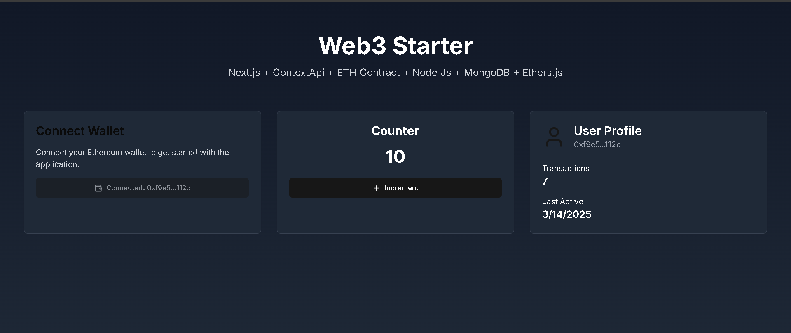

# Web3 Starter Project  

This is a template **Next.js** project that integrates **Ethereum wallet interactions** using **ethers.js**. It allows users to interact with a **Counter smart contract**, storing transaction data in **MongoDB**. The project leverages **Context API** for managing user profiles and updates them dynamically based on blockchain interactions.  

### Key Features:  
- Built with **Next.js** for a modern frontend experience  
- Uses **ethers.js** to connect with a smart contract and execute transactions  
- Wallet connection and authentication via **MetaMask**  
- **MongoDB** stores user transaction history and profile data  
- **Context API** manages global state for user profiles  
- Responsive and clean UI using **Tailwind CSS**  

